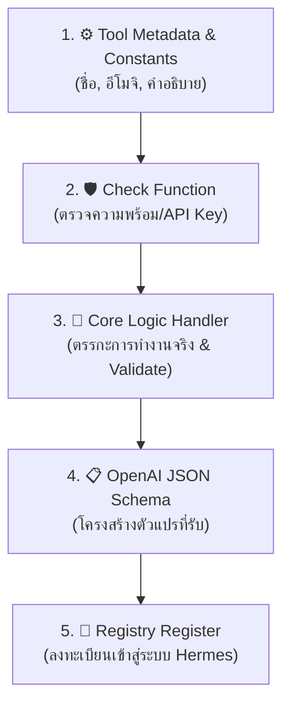

# 🛠️ คู่มือแม่แบบการพัฒนาเครื่องมือใหม่สำหรับ Hermes Agent (Custom Tool Guide)

> **มาตรฐานการพัฒนา Custom Tool คุณภาพสูง ยืดหยุ่น และพร้อมใช้งานจริง (Enterprise Grade)**  
> สร้างขึ้นจากการวิเคราะห์โครงสร้างเครื่องมือทั้งหมด 269 ไฟล์ใน Hermes Agent Architecture

---

## 🌟 1. สถาปัตยกรรม 5 เสาหลักของ Tool ใน Hermes

ทุกไฟล์เครื่องมือใน `tools/` จะประกอบด้วย 5 ส่วนมาตรฐาน:



---

## 📂 2. พิกัดไฟล์แม่แบบ (Master Blueprint File)

มายสร้างไฟล์แม่แบบต้นฉบับไว้ให้บอสที่:  
👉 [`hermes-agent/tools/_template_custom_tool.py`](file:///Users/meuu/Desktop/รวมโปรเจ็ค/hermesv2/hermes-agent/tools/_template_custom_tool.py)

---

## ⚡ 3. วิธีการสร้าง Tool ใหม่ใน 3 ขั้นตอนง่ายๆ

### ขั้นตอนที่ 1: คัดลอกและตั้งชื่อไฟล์
ก๊อปปี้ไฟล์ `_template_custom_tool.py` ไปเป็นชื่อเครื่องมือใหม่ในโฟลเดอร์ `tools/` เช่น:
- `tools/crypto_tracker_tool.py`
- `tools/line_notify_tool.py`
- `tools/database_query_tool.py`

### ขั้นตอนที่ 2: แก้ไข 3 จุดสำคัญในโค้ด
1. **Business Logic:** ใส่โค้ดยิง API / คำนวณ / ดึงข้อมูลลงในฟังก์ชันหลัก
2. **Schema:** แก้ชื่อตัวแปรและประเภทข้อมูลที่ต้องการให้ AI ส่งเข้ามา
3. **Registry:** กำหนดชื่อ Tool และ Toolset (เช่น `"coding"`, `"web"`, `"lifestyle"`)

### ขั้นตอนที่ 3: บันทึกไฟล์แล้วทดสอบได้ทันที!
ระบบ Hermes มีระบบ **Auto-Discovery** ที่จะสแกนและโหลดเครื่องมือใหม่เข้าสู่สมองทันทีโดยไม่ต้อง Build ใหม่:
```bash
# ทดสอบรันเครื่องมือแบบ One-shot
hermes -z "ช่วยเรียกใช้ <ชื่อเครื่องมือของคุณ> ให้หน่อย"
```

---

## 🛡️ 4. กฎเหล็ก & Best Practices เพื่อคุณภาพสูงสุด (Golden Rules)

1. **🔒 ปลอดภัยและครอบคลุม Error:** ใช้ `tool_error("ข้อความ...")` เสมอเมื่อเกิดปัญหา เพื่อให้ AI เข้าใจและแก้ไขตัวเองได้
2. **🇹🇭 รองรับภาษาไทยสมบูรณ์:** เวลาแปลงข้อมูลเป็น JSON ส่งคืน ให้ใส่ `ensure_ascii=False` เสมอ
3. **🎯 คำอธิบาย Schema ต้องชัดเจน:** คำอธิบายใน `description` คือสิ่งที่ AI ใช้อ่านเพื่อตัดสินใจว่าจะหยิบเครื่องมือนี้มาใช้เมื่อไหร่
4. **🧪 มี Unit Test ในตัว:** ใส่บล็อก `if __name__ == "__main__":` ไว้ด้านล่างไฟล์เสมอ เพื่อให้บอสกดคลิกเดียวรันเทสต์ฟังก์ชันได้ทันที
